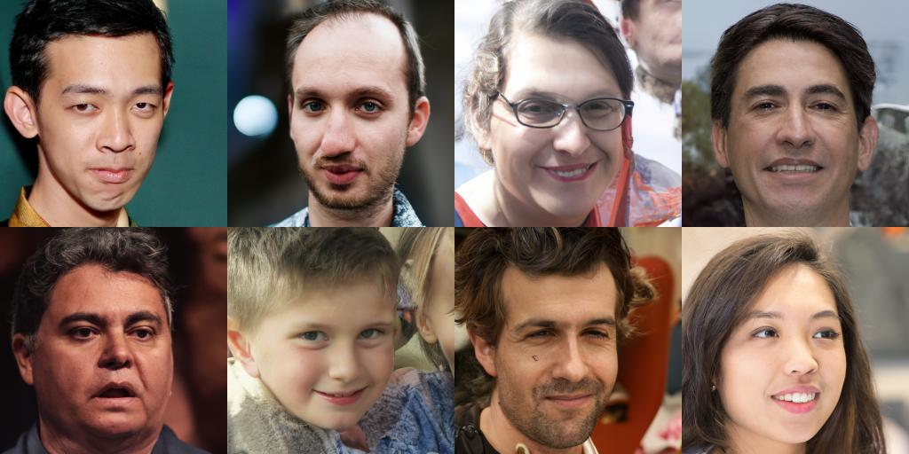

# Your diffusion model secretly knows the dimension of the data manifold

This repo contains a PyTorch implementation for the paper [Your diffusion model secretly knows the dimension of the data manifold]([https://openreview.net/forum?id=PxTIG12RRHS](https://arxiv.org/abs/2212.12611))

by Jan Stanczuk*, Georgios Batzolis*, Teo Deveney and Carola-Bibiane Schönlieb

--------------------

In this work, we provide a mathematical proof that diffusion models encode data manifolds by approximating their normal bundles. Based on this observation we propose a novel method for extracting the intrinsic dimension of the data manifold from a trained diffusion model. Our insights are based on the fact that a diffusion model approximates the score function i.e. the gradient of the log density of a noise-corrupted version of the target distribution for varying levels of corruption. We prove that as the level of corruption decreases, the score function points towards the manifold, as this direction becomes the direction of maximal likelihood increase. Therefore, at low noise levels, the diffusion model provides us with an approximation of the manifold's normal bundle, allowing for an estimation of the manifold's intrinsic dimension. To the best of our knowledge, our method is the first diffusion-based estimator of intrinsic dimension that comes with theoretical guarantees, and it outperforms well-established estimators in controlled experiments on both Euclidean and image data.

## How to run the code

### Dependencies

Run the following to install a subset of necessary python packages for our code
```sh
pip install -r req.txt
```

### Usage

Train and evaluate our models through `main.py`.

```sh
main.py:
  --config: Training configuration.
    (default: 'None')
  --mode: <train|manifold_dimension>: Running mode: train (for training diffusion model on your data) or manifold_dimension for estimating the ID after training the model.
```

* `config` is the path to the config file. Our prescribed config files are provided in `configs/`. They are formatted according to [`ml_collections`](https://github.com/google/ml_collections) and should be quite self-explanatory.

  **Naming conventions of config files**: the path of a config file is a combination of the following dimensions:
  *  dataset: One of `cifar10`, `celeba`, `celebahq`, `celebahq_256`, `ffhq_256`, `celebahq`, `ffhq`.
  * model: One of `ncsn`, `ncsnv2`, `ncsnpp`, `ddpm`, `ddpmpp`.
  * continuous: train the model with continuously sampled time steps. 

*  `workdir` is the path that stores all artifacts of one experiment, like checkpoints, samples, and evaluation results.

* `eval_folder` is the name of a subfolder in `workdir` that stores all artifacts of the evaluation process, like meta checkpoints for pre-emption prevention, image samples, and numpy dumps of quantitative results.

* `mode` is either "train" or "eval". When set to "train", it starts the training of a new model, or resumes the training of an old model if its meta-checkpoints (for resuming running after pre-emption in a cloud environment) exist in `workdir/checkpoints-meta` . When set to "eval", it can do an arbitrary combination of the following

  * Evaluate the loss function on the test / validation dataset.

  * Generate a fixed number of samples and compute its Inception score, FID, or KID. Prior to evaluation, stats files must have already been downloaded/computed and stored in `assets/stats`.

  * Compute the log-likelihood on the training or test dataset.

  These functionalities can be configured through config files, or more conveniently, through the command-line support of the `ml_collections` package. For example, to generate samples and evaluate sample quality, supply the  `--config.eval.enable_sampling` flag; to compute log-likelihoods, supply the `--config.eval.enable_bpd` flag, and specify `--config.eval.dataset=train/test` to indicate whether to compute the likelihoods on the training or test dataset.

## How to extend the code
* **New SDEs**: inherent the `sde_lib.SDE` abstract class and implement all abstract methods. The `discretize()` method is optional and the default is Euler-Maruyama discretization. Existing sampling methods and likelihood computation will automatically work for this new SDE.
* **New predictors**: inherent the `sampling.Predictor` abstract class, implement the `update_fn` abstract method, and register its name with `@register_predictor`. The new predictor can be directly used in `sampling.get_pc_sampler` for Predictor-Corrector sampling, and all other controllable generation methods in `controllable_generation.py`.
* **New correctors**: inherent the `sampling.Corrector` abstract class, implement the `update_fn` abstract method, and register its name with `@register_corrector`. The new corrector can be directly used in `sampling.get_pc_sampler`, and all other controllable generation methods in `controllable_generation.py`.

## Pretrained checkpoints
All checkpoints are provided in this [Google drive](https://drive.google.com/drive/folders/1tFmF_uh57O6lx9ggtZT_5LdonVK2cV-e?usp=sharing).

**Instructions**: You may find two checkpoints for some models. The first checkpoint (with a smaller number) is the one that we reported FID scores in our paper's Table 3 (also corresponding to the FID and IS columns in the table below). The second checkpoint (with a larger number) is the one that we reported likelihood values and FIDs of black-box ODE samplers in our paper's Table 2 (also FID(ODE) and NNL (bits/dim) columns in the table below). The former corresponds to the smallest FID during the course of training (every 50k iterations). The later is the last checkpoint during training.

Per Google's policy, we cannot release our original CelebA and CelebA-HQ checkpoints. That said, I have re-trained models on FFHQ 1024px, FFHQ 256px and CelebA-HQ 256px with personal resources, and they achieved similar performance to our internal checkpoints. 

Here is a detailed list of checkpoints and their results reported in the paper. **FID (ODE)** corresponds to the sample quality of black-box ODE solver applied to the probability flow ODE.

| Checkpoint path | FID | IS | FID (ODE) | NNL (bits/dim) |
|:----------|:-------:|:----------:|:----------:|:----------:|
| [`ve/cifar10_ncsnpp/`](https://drive.google.com/drive/folders/1sP4GwvrYiI-sDPTp7sKYzsxJLGVamVMZ?usp=sharing) |  2.45 | 9.73 | - | - |
| [`ve/cifar10_ncsnpp_continuous/`](https://drive.google.com/drive/folders/1b0gy_LLgO_DaQBgoWXwlVnL_rcAUgREh?usp=sharing) | 2.38 | 9.83 | - | - |
| [`ve/cifar10_ncsnpp_deep_continuous/`](https://drive.google.com/drive/folders/11s6A_xM7qiztdj8AHQWqaIAUSC3I7uX2?usp=sharing) | **2.20** | **9.89** | - | - |
| [`vp/cifar10_ddpm/`](https://drive.google.com/drive/folders/1zDKcy3xbsN3F4AfyB_DfY_1oho89iKcf?usp=sharing) | 3.24 | - | 3.37 | 3.28 |
| [`vp/cifar10_ddpm_continuous`](https://drive.google.com/drive/folders/1RHNxW1qY-mTr0JMAE5t4V181Hi_aVWXK?usp=sharing) | - | - | 3.69| 3.21 |
| [`vp/cifar10_ddpmpp`](https://drive.google.com/drive/folders/1zOVj03ZBcq339p5QEKJPh2bBrxR_HOCM?usp=sharing) | 2.78 | 9.64 | - | - |
| [`vp/cifar10_ddpmpp_continuous`](https://drive.google.com/drive/folders/1xYjVMx10N9ivQQBIsEoXEeu9nvSGTBrC?usp=sharing) | 2.55 | 9.58 | 3.93 | 3.16 |
| [`vp/cifar10_ddpmpp_deep_continuous`](https://drive.google.com/drive/folders/1ZMLBiu9j7-rpdTQu8M2LlHAEQq4xRYrj?usp=sharing) | 2.41 | 9.68 | 3.08 | 3.13 |
| [`subvp/cifar10_ddpm_continuous`](https://drive.google.com/drive/folders/1DeebpmBkCxlZx89t3z45Te37T7BPOzd2?usp=sharing) | - | - | 3.56 | 3.05 |
| [`subvp/cifar10_ddpmpp_continuous`](https://drive.google.com/drive/folders/1bLgmnEAZnysRZfWt8qN3omGfijJ_B884?usp=sharing) | 2.61 | 9.56 | 3.16 | 3.02 |
| [`subvp/cifar10_ddpmpp_deep_continuous`](https://drive.google.com/drive/folders/16QGkviGcizSbIPRk37-YksUhlNIna4Ys?usp=sharing) | 2.41 | 9.57 | **2.92** | **2.99** |

| Checkpoint path | Samples |
|:-----|:------:|
| [`ve/bedroom_ncsnpp_continuous`](https://drive.google.com/drive/folders/18GmxDvfGR8se9uFucc9uweeVrX_GzuUG?usp=sharing) |  |
| [`ve/church_ncsnpp_continuous`](https://drive.google.com/drive/folders/1zVChA0HrnJU66Jkt4P6KOnlREhBMc4Yh?usp=sharing) |  |
| [`ve/ffhq_1024_ncsnpp_continuous`](https://drive.google.com/drive/folders/1ZqLNr_kH0o9DxvwSlrQPMmkrhEnXhBm2?usp=sharing) ||
| [`ve/ffhq_256_ncsnpp_continuous`](https://drive.google.com/drive/folders/1KG72ZKUCUa8dDcA03hOf1BsnK8kBcdPD?usp=sharing) ||
| [`ve/celebahq_256_ncsnpp_continuous`](https://drive.google.com/drive/folders/19VJ7UZTE-ytGX6z5rl-tumW9c0Ps3itk?usp=sharing) ||


## Demonstrations and tutorials
| Link | Description|
|:----:|:-----|
|[](https://colab.research.google.com/drive/1dRR_0gNRmfLtPavX2APzUggBuXyjWW55?usp=sharing)  | Load our pretrained checkpoints and play with sampling, likelihood computation, and controllable synthesis (JAX + FLAX)|
|[](https://colab.research.google.com/drive/17lTrPLTt_0EDXa4hkbHmbAFQEkpRDZnh?usp=sharing) | Load our pretrained checkpoints and play with sampling, likelihood computation, and controllable synthesis (PyTorch) |
|[](https://colab.research.google.com/drive/1SeXMpILhkJPjXUaesvzEhc3Ke6Zl_zxJ?usp=sharing) | Tutorial of score-based generative models in JAX + FLAX |
|[](https://colab.research.google.com/drive/120kYYBOVa1i0TD85RjlEkFjaWDxSFUx3?usp=sharing)| Tutorial of score-based generative models in PyTorch |


## Tips
* When using the JAX codebase, you can jit multiple training steps together to improve training speed at the cost of more memory usage. This can be set via `config.training.n_jitted_steps`. For CIFAR-10, we recommend using `config.training.n_jitted_steps=5` when your GPU/TPU has sufficient memory; otherwise we recommend using `config.training.n_jitted_steps=1`. Our current implementation requires `config.training.log_freq` to be dividable by `n_jitted_steps` for logging and checkpointing to work normally.
* The `snr` (signal-to-noise ratio) parameter of `LangevinCorrector` somewhat behaves like a temperature parameter. Larger `snr` typically results in smoother samples, while smaller `snr` gives more diverse but lower quality samples. Typical values of `snr` is `0.05 - 0.2`, and it requires tuning to strike the sweet spot.
* For VE SDEs, we recommend choosing `config.model.sigma_max` to be the maximum pairwise distance between data samples in the training dataset.

## References

If you find the code useful for your research, please consider citing
```bib
@inproceedings{
  song2021scorebased,
  title={Score-Based Generative Modeling through Stochastic Differential Equations},
  author={Yang Song and Jascha Sohl-Dickstein and Diederik P Kingma and Abhishek Kumar and Stefano Ermon and Ben Poole},
  booktitle={International Conference on Learning Representations},
  year={2021},
  url={https://openreview.net/forum?id=PxTIG12RRHS}
}
```

This work is built upon some previous papers which might also interest you:

* Song, Yang, and Stefano Ermon. "Generative Modeling by Estimating Gradients of the Data Distribution." *Proceedings of the 33rd Annual Conference on Neural Information Processing Systems*. 2019.
* Song, Yang, and Stefano Ermon. "Improved techniques for training score-based generative models." *Proceedings of the 34th Annual Conference on Neural Information Processing Systems*. 2020.
* Ho, Jonathan, Ajay Jain, and Pieter Abbeel. "Denoising diffusion probabilistic models." *Proceedings of the 34th Annual Conference on Neural Information Processing Systems*. 2020.

